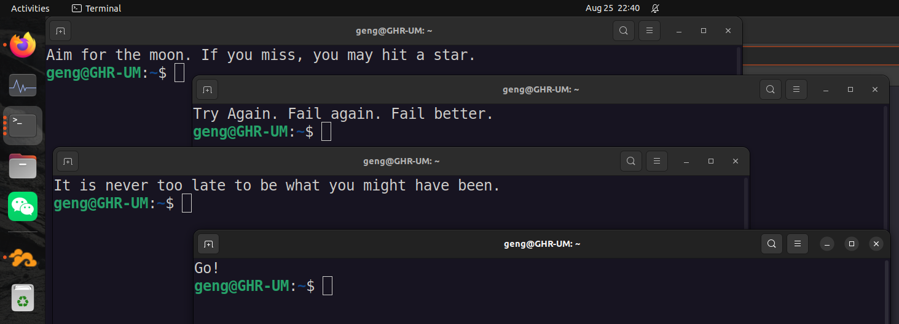
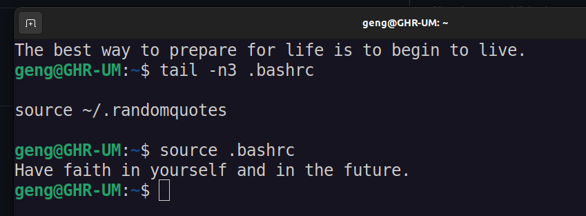

# randomquotes
echo a random quote every time you start the terminal

## How to use
`cp ./randomquotes.sh ~/.randomquotes`

Add `source ~/.randomquotes` to the end of ~/.bashrc 

## Quotes Source:
Thanks to:

[130 Short Quotes That Will Inspire You (Fast)](https://wisdomquotes.com/short-quotes/)

[Short Inspirational Quotes to Fuel Your Day](https://everydaypower.com/short-inspirational-quotes/)
